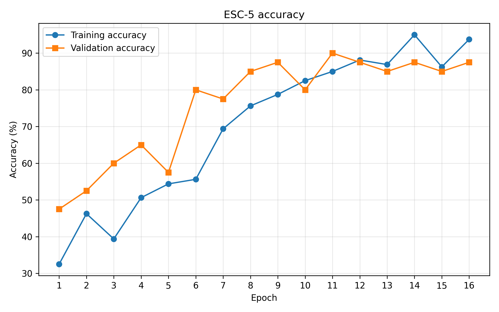

# VisionMLBN for Environmental Sound Classification

This repository explores the use of a vision-oriented bidirectional state-space
model for environmental sound classification. Audio clips are converted into
log-Mel spectrogram images and then evaluated with VisionMLBN, a ResNet-18
baseline, and conventional MFCC classifiers.

The project focuses on the experiment pipeline around the model: audio
preprocessing, dataset splits, training configuration, baseline comparisons,
and result visualization. It is an exploratory research implementation rather
than an official benchmark.

## Experiment pipeline

1. Load five-second audio clips from ESC-50 or a custom audio collection.
2. Resample clips to 16 kHz and compute 128-bin log-Mel spectrograms.
3. Resize each spectrogram to a 224 × 224 RGB image.
4. Preserve the predefined ESC-50 folds when creating training and validation
   directories.
5. Train VisionMLBN on the resulting `ImageFolder` dataset.
6. Compare the model with ResNet-18 and MFCC-based SVM or MLP baselines.

The repository includes preprocessing variants for ESC-5, ESC-10, and the full
ESC-50 dataset.

## Recorded runs

The committed plotting data contains the following single-run results:

| Dataset subset | Recorded epochs | Best validation accuracy | Final validation accuracy |
| --- | ---: | ---: | ---: |
| ESC-5 | 16 | 90.00% | 87.50% |
| ESC-10 | 20 | 78.75% | 77.50% |

These values are included as experiment records, not as benchmark claims. The
runs were not aggregated across all five ESC-50 folds.



## Repository structure

```text
.
├── configs/                    # VisionMLBN experiment configurations
├── environment/                # Historical environment snapshots
├── results/
│   └── figures/                # Recorded and regenerated plots
├── scripts/
│   ├── diagnostics/            # Import checks and PyTorch profiling
│   ├── plots/                  # Scripts for reproducible figures
│   ├── preprocessing/          # Audio-to-spectrogram pipelines
│   └── training/               # VisionMLBN and baseline trainers
├── src/
│   └── vision_mlbn/            # Model package
├── Makefile                    # Optional Singularity/HPC helper
├── pyproject.toml
└── requirements.txt
```

## Setup

The preprocessing, baseline, and plotting tools can be installed in a regular
Python environment:

```bash
python -m venv .venv
source .venv/bin/activate
pip install -r requirements.txt
pip install -e .
```

On Windows PowerShell, activate the environment with:

```powershell
.venv\Scripts\Activate.ps1
```

VisionMLBN also requires PyTorch, `causal-conv1d`, and `mamba-ssm`. Their
compatible versions depend on the operating system, CUDA version, and PyTorch
build, so they are intentionally not pinned in the portable requirements file.
The `Makefile` and `environment/` snapshots document the HPC setup used for the
original experiments.

## Dataset preparation

Download or clone the
[ESC-50 dataset](https://github.com/karolpiczak/ESC-50) into
`data/ESC-50-master`. The dataset directory should contain `audio/` and
`meta/esc50.csv`.

Generate the ESC-10 spectrogram subset:

```bash
python scripts/preprocessing/preprocess_esc10.py
```

The equivalent ESC-5 and ESC-50 commands are:

```bash
python scripts/preprocessing/preprocess_esc5.py
python scripts/preprocessing/preprocess_esc50.py
```

Each script accepts command-line options for dataset location, output
directory, sample rate, Mel bins, image size, and validation fold.

## Training

After installing the model package and the compatible GPU dependencies, run a
configured VisionMLBN experiment:

```bash
python scripts/training/train_vision_mlbn.py \
  --config configs/tiny_esc10_epoch20.yaml
```

Run the ResNet-18 image baseline:

```bash
python scripts/training/train_resnet18.py \
  --data_root data/processed/esc10
```

Run an MFCC baseline directly on the ESC-50 audio files:

```bash
python scripts/training/train_mfcc.py \
  --csv_path data/ESC-50-master/meta/esc50.csv \
  --audio_dir data/ESC-50-master/audio \
  --esc10_only \
  --classifier svm
```

Set `--classifier mlp` to use the MLP baseline.

## Recreating the figures

The plot scripts write English figures to `results/figures/`:

```bash
python scripts/plots/plot_esc5_accuracy.py
python scripts/plots/plot_esc10_accuracy.py
python scripts/plots/plot_esc5_loss.py
python scripts/plots/plot_esc10_loss.py
```

## Limitations

- The recorded metrics are from individual runs rather than repeated
  cross-validation experiments.
- Dataset files and model checkpoints are not stored in the repository.
- The Mamba CUDA extensions require environment-specific installation.
- The current comparison emphasizes pipeline feasibility; it does not establish
  a state-of-the-art result on ESC-50.

## Attribution

The VisionMLBN package under `src/vision_mlbn/` retains the original project
metadata in `pyproject.toml`. This repository adds the audio preprocessing,
experiment configuration, baseline, and evaluation workflow around that model.

Background references:

- K. J. Piczak, [ESC: Dataset for Environmental Sound Classification](https://doi.org/10.1145/2733373.2806390), ACM Multimedia 2015.
- L. Zhu et al., [Vision Mamba: Efficient Visual Representation Learning with Bidirectional State Space Model](https://arxiv.org/abs/2401.09417), ICML 2024.
- The official [Vision Mamba implementation](https://github.com/hustvl/Vim).
